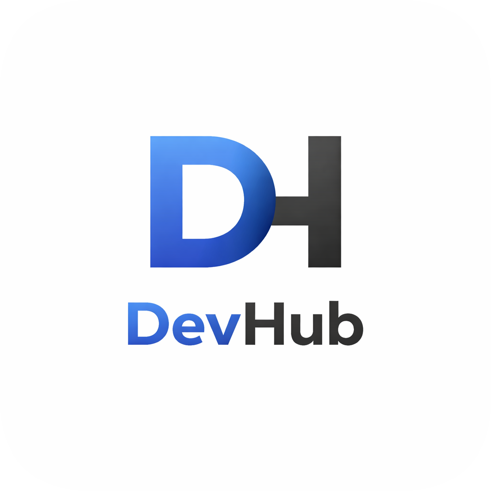

<p align="center">
  
</p>

<h1 align="center">DevHub</h1>

<p align="center">
  Personal development center — organize your projects, links, and IDEs in one place.
</p>

<p align="center">
  
  
  
  
</p>

---

## About

DevHub is a Windows desktop utility for developers that helps you:

- **Manage projects** — catalog your projects with quick launch in any IDE
- **Save links** — capture URLs from clipboard with a single hotkey
- **Discover IDEs** — auto-detect installed code editors
- **Stay focused** — live in system tray, always one click away

## Features

### Project Management
- Catalog with name, path, language, description, and notes
- Favorites pinned to the top
- Filter by status (Active, Completed, Paused, Archived)
- Search by name and path
- Launch in configured IDE or open in Explorer

### Link Capture
- Global hotkey **Ctrl+Shift+Y** captures URL from clipboard
- Auto-detects link type (YouTube, GitHub, Documentation, Article)
- Attach links to projects
- Search and filter by type

### IDE Auto-Detection
- Automatically finds VS Code, Visual Studio, Rider, IntelliJ IDEA, WebStorm, PyCharm, and more
- Set preferred IDE per project

### System Tray
- Minimize to tray on close (configurable)
- Autostart with Windows (optional)
- Balloon notifications on link capture

## Requirements

- Windows 10/11 (x64)
- .NET 10 Runtime

## Build & Run

```bash
git clone https://github.com/GreDDySS/DevHub.git
cd DevHub
dotnet build
dotnet run --project src/DevHub.Presentation
```

## Data Storage

All data is stored in `%AppData%/DevHub/`:
- `projects.json` — project catalog
- `links.json` — captured links
- `settings.json` — app settings
- `logs/` — log files (retained 30 days)


## Keyboard Shortcuts

| Shortcut | Action |
|----------|--------|
| Ctrl+Shift+Y | Capture URL from clipboard |

## License

MIT
