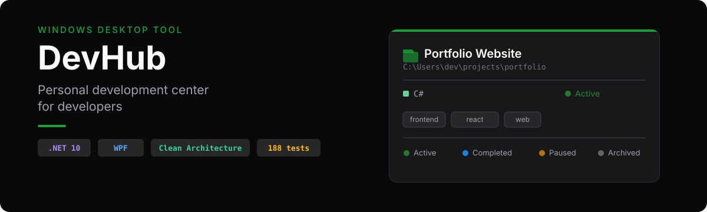
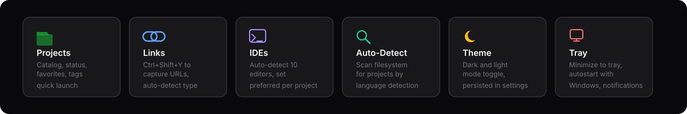
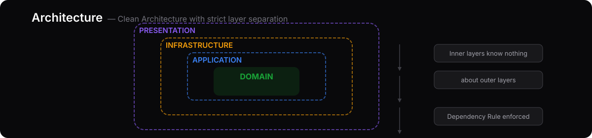

<p align="center">
  
</p>

## What it does

DevHub is a Windows desktop utility that helps developers stay organized:

- **Manage projects** — catalog with quick launch in any IDE, filter by status, search with debounce
- **Capture links** — global hotkey **Ctrl+Shift+Y** grabs URLs from clipboard with auto-detection
- **Auto-detect IDEs** — finds VS Code, Visual Studio, Rider, and 7 more editors on your machine
- **Scan for projects** — discovers codebases on disk by language detection

Lives in the system tray, always one click away.

<p align="center">
  
</p>

## Build & Run

```bash
git clone https://github.com/GreDDySS/DevHub.git
cd DevHub
dotnet build
dotnet run --project src/DevHub.Presentation
```

Requires Windows 10/11 (x64) and .NET 10 Runtime.

<p align="center">
  
</p>

## Project Structure

```
DevHub/
├── src/
│   ├── DevHub.Domain/           — Models, enums, interfaces, domain events
│   ├── DevHub.Application/      — Use cases, DTOs, application interfaces
│   ├── DevHub.Infrastructure/   — JSON storage, IDE scanner, process launcher
│   └── DevHub.Presentation/     — WPF UI: Views, ViewModels, Services
├── tests/
│   ├── DevHub.Domain.Tests/
│   ├── DevHub.Application.Tests/
│   ├── DevHub.Infrastructure.Tests/
│   ├── DevHub.Integration.Tests/
│   └── DevHub.Presentation.Tests/
└── docs/                        — Refactoring plans, code reviews
```

## Tech Stack

| Package | Purpose |
|---------|---------|
| CommunityToolkit.Mvvm | MVVM framework with source generators |
| Microsoft.Extensions.DependencyInjection | Dependency injection |
| Serilog | Structured logging |
| xunit | Unit and integration testing |
| Microsoft.Extensions.Http | HTTP client for API calls |

## Data Storage

All data is stored in `%AppData%/DevHub/`:

| File | Contents |
|------|----------|
| `projects.json` | Project catalog |
| `links.json` | Captured links |
| `settings.json` | IDE config, close action, autostart, theme |
| `logs/` | Log files (retained 7 days, 10 MB limit) |
| `backup/` | Data backups |

## Keyboard Shortcuts

| Shortcut | Action |
|----------|--------|
| Ctrl+Shift+Y | Capture URL from clipboard |

## License

MIT
